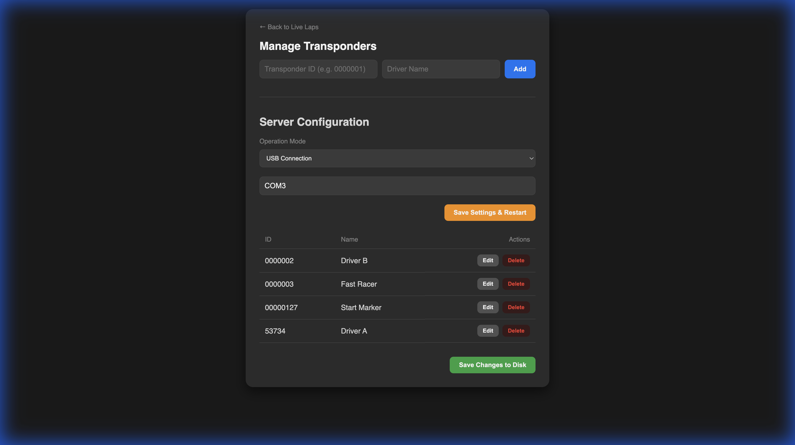

# RRCLiveLaps
A simple web page showing live local lap times from a Race|Result decoder.




## Overview
RRCLiveLaps is a standalone web server that acts as a bridge between your timing hardware and a live audience display. It connects to the `rrconverter` service to receive live timing data and broadcasts it to connected web clients.

## Features
- **Live Timing Display**: Real-time lap updates.
- **Management Interface**: Configure connection settings and map Transponder IDs to Driver Names.
- **Persistence**: Configuration and driver mappings are saved to disk.
- **Portability**: The application looks for its configuration files (`config.json`, `mapping.json`) in the same directory as the executable, making it easy to deploy anywhere.

## Usage

### Running the Application
1.  **Download/Build**: Get the executable (`rrclivelaps`).
2.  **Run**: Double-click the executable or run it from the command line.
    ```bash
    ./rrclivelaps
    ```
3.  **Browser**: The application will automatically open your default web browser.

### Configuration
Access the **Manage** page by clicking the hidden "Manage" button in the bottom-left corner of the main page, or by navigating to `/manage.html`.

From here you can:
- **Set Mode**: Choose between TCP (Direct Network), USB, or TCP Server mode.
- **Manage Transponders**: Map physical transponder IDs to human-readable driver names.
- **Save Settings**: Clicking "Save Settings & Restart" will save your configuration to `config.json` and gracefully shut down the server. Simply restart the application to apply the changes.

## Installation

### Prerequisites
1.  **RRConverter**: You must have `rrconverter` running to bridge the connection to your decoder. [Get it here](https://github.com/gilliangoud/rrconverter).
2.  **Mock Decoder (Optional)**: For testing without real hardware, run the `mock-decoder`.

### Build from Source
1.  Ensure you have Rust installed.
2.  Clone the repository and run:
    ```bash
    cd rrclivelaps
    cargo run
    ```
    To build a release binary:
    ```bash
    cargo build --release
    ```

## Files
- `rrclivelaps` (Executable)
- `config.json`: Stores connection settings (Host, Port, Mode). Created automatically if missing.
- `mapping.json`: Stores Transponder ID -> Name mappings.

## Customizing Transponder Names
You can also manually edit `mapping.json` in the same directory as the executable:
```json
{
    "0000001": "Max Verstappen",
    "0000002": "Lewis Hamilton",
    "00000127": "Pace Car"
}
```
Restart the application to reload changes.